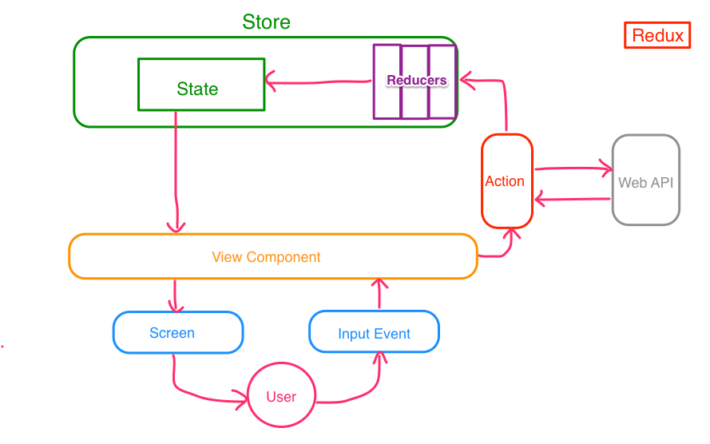

# Overview của Redux

- [Site chính thức Redux](http://rackt.org/redux/index.html)
- [Document chính thức](http://redux.js.org/index.html)

## Lời mở đầu
Tuy chỉ mô tả overview 1 cách sơ bộ, nhưng hãy nắm bắt trước những từ chuyên môn hay data flow dưới đây một cách tối thiểu nhất. Trường hợp muốn hiểu sâu thêm nữa thì hãy tham khảo Document chính thức.

## Bức tranh tổng thể của Redux


## 3 nguyên tắc
http://rackt.org/redux/docs/introduction/ThreePrinciples.html

|1.Single source of truth(Source chỉ có 1)|
|-|
|Trạng thái tổng thể application(`state`)được tạo nên bởi 1 object có dạng cây, và được lưu ở 1 store. Vì `state` dễ lưu nên việc tạo Universal application là dễ. Vì `state` chỉ có 1, nên dễ debug, dễ phát triển.|

|2.State is read-only(Trạng thái là chuyên dùng để đọc)|
|-|
|Solution thay đổi trạng thái là, chỉ cần phát hành Action Object đã có nội dung thay đổi và implement là được. View hay callback không thể thay đổi trực tiếp trạng thái. Việc thay đổi sẽ được tiến hành tuần tự từng cái một. Vì action là object, nên có khả năng lưu giữ và dễ test.|

|3.Mutations are written as pure functions(Việc thay đổi thì tất cả được viết bằng hàm số thuần túy)|
|-|
|Việc action sẽ thay đổi trạng thái thành thế nào thì sẽ thực hiện bằng `Reducer`. `Reducer` là hàm số sẽ nhận trạng thái và action rồi trả ra trạng thái mới. Point ở đây là sẽ không thay đổi `state` hiện tại mà sẽ tạo ta object `state` mới rồi trả lại. Ban đầu sẽ chuẩn bị 1 `Reducer` bằng application, và khi nó phình ro rồi thì phân chia `Reducer`.|

## Từ chuyên môn

### Action
- Object để gửi thông tin từ application đến `store`
- Sẽ được gửi đến `store` bằng `store.dispatch()`
- Để phân biệt xem thứ sẽ tiến hành là gì, thì bắt byoocj phải có `type` Property. Cái `type` này gọi là `ActionType`.

```js
const ADD_TODO = 'ADD_TODO';
{
  type: ADD_TODO,
  text: 'Build my first Redux app'
};
```

### ActionCreator
Là hàm số tạo Action.

```js
function addTodo(text) {
  return {
    type: ADD_TODO,
    text: text
  };
}
```

Khi `dispatch` thì sẽ truyền `action()` đã tạo bằng `creator`.

```
dispatch(addTodo(text));
```

### Store
**Nhiệm vụ**
- Duy trì `state`
- Cung cấp `getState()` để access vào `state`
- Cung cấp `dispatch(action)` để update `state`
- Cung cấp `subscribe(listener)` để đăng ký listener

`store` thì bắt buộc chỉ có 1. Trường hợp muốn phân chia logic theo từng `state`, thì không phân chia `store`, mà hãy sử dụng `reducer composition`.

Để tạo `store` thì sẽ truyền `reducer` đã được tạo bằng `combineReducer` đến `createStore()`.

```js
import { createStore } from 'redux';
import todoApp from './reducers';
const store = createStore(todoApp);
```

### Reducer
- Là method thuần túy chỉ để nhận `state` và `action` hiện tại, rồi trả ra `state` mới.
 
```js
(previousState, action) => newState;
```

Trong `reducer` cần phải làm những việc dưới đây
- Thay đổi giá trị Instance `state`, `action` của tham số
- Gây ra tác dụng phụ (Như gọi API, biến đổi routing)
- Điều khiển quản lý những thứ thay đổi thường xuyên (`Date.now()`, hoặc là `Math.random()`)

### Middleware
- Là cơ chế có thể bổ sung xử lý tùy ý vào trước hay sau khi `dispatch`
- Export log trạng thái của `state` trước và sau khi `dispatch`
- Vì Middleware đã implement có chủ ý  đã được đưa lên npm, nên sử dụng tùy ý  https://www.npmjs.com/search?q=redux%20middleware
